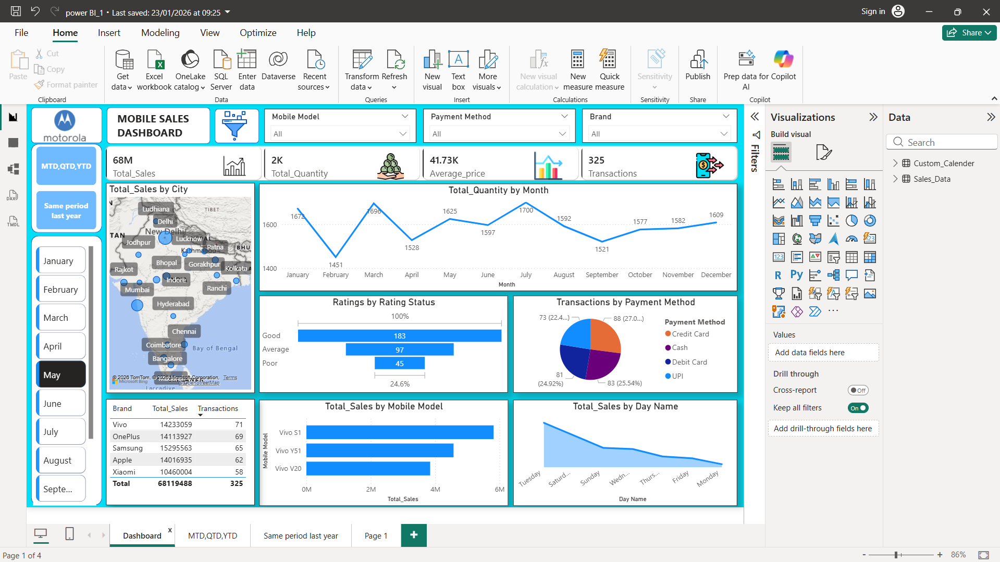
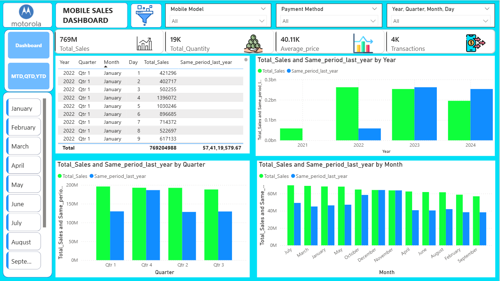
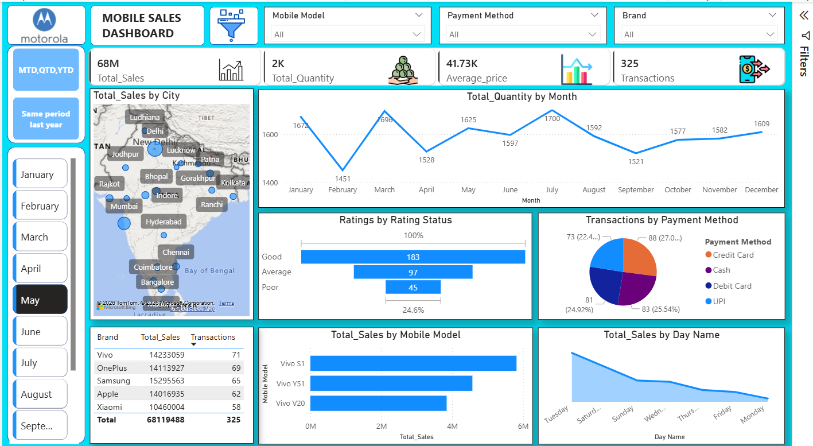

# 📊 Power BI Sales & Performance Dashboard

## Project Overview

This project presents an end-to-end **Power BI dashboard** designed to analyze business performance, identify trends, and deliver actionable insights to stakeholders.
The dashboard focuses on sales, profitability, customer behavior, and operational KPIs using interactive visuals and a well-structured data model.

The objective of this project is to demonstrate **practical Power BI skills** including data modeling, DAX calculations, visualization best practices, and business-oriented storytelling.

---

## Business Problem

Organizations often struggle to:

* Track overall sales and profit performance
* Identify top-performing and underperforming products
* Understand regional and time-based trends
* Monitor key KPIs in a single, consolidated view

This dashboard addresses these challenges by providing a **centralized, interactive analytics solution**.

---

## Key Features

* Interactive slicers for dynamic filtering
* KPI cards for quick performance tracking
* Trend analysis using line and bar charts
* Category and region-wise performance breakdown
* Drill-down enabled visuals for deeper analysis
* Optimized data model for performance and scalability

---

## Tools & Technologies Used

* **Power BI Desktop**
* **DAX (Data Analysis Expressions)**
* **Power Query (ETL & Data Transformation)**
* **Data Modeling (Star Schema)**
* **Excel / CSV (Data Source)**

---

## Key Metrics & KPIs

* Total Sales
* Total Profit
* Profit Margin (%)
* Units Sold
* Average Sales per Transaction
* Growth Trends (Month-over-Month / Year-over-Year)

---

## Dashboard Screenshots

### Overview & KPI Summary




### Sales & Profit Analysis




### Category & Product Insights



<!-- 

### Regional & Time-Based Insights


### Advanced Views & Filters


 -->

---

## YouTube Project Walkthrough

A detailed explanation of the dashboard design, data modeling, DAX logic, and business insights is available in the video below:

🎥 **Project Deep Explanation Video**
👉 [https://www.youtube.com/watch?v=YOUR_VIDEO_LINK_HERE](https://www.youtube.com/watch?v=YOUR_VIDEO_LINK_HERE)

*(The video covers problem understanding, dashboard design decisions, KPI logic, and insights interpretation.)*

---

## Project Structure

```
PowerBI-Dashboard-Project/
│
├── MS_Dashboard.pbix
├── README.md
├── screens/
│   ├── img1.jpg
│   ├── img2.jpg
│   ├── img3.jpg
│   ├── img4.jpg
│   ├── img5.jpg
│   ├── img6.jpg
│   ├── img7.jpg
│   ├── img8.jpg
│   ├── img9.jpg
│   └── img10.jpg
```

---

## How to Use This Project

1. Download the `.pbix` file from this repository
2. Open it using **Power BI Desktop**
3. Explore the dashboard using slicers and filters
4. Review DAX measures and data model for learning/reference

---

## Key Learnings

* Designing dashboards with business-first thinking
* Writing efficient and readable DAX measures
* Creating interactive and performance-optimized visuals
* Structuring Power BI projects for professional delivery

---

## Author

**Rajat Billore**
Aspiring Data Analyst | Power BI | SQL | Python
📌 LinkedIn: *(Add your LinkedIn link here)*
📌 GitHub: *(This repository)*

---

